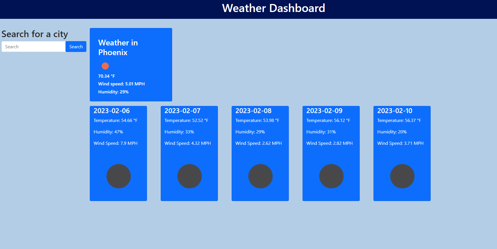

# Weather-Dashboard

## Description

Weather DashBoard allows you to search for the weather in any city and the current and future conditions up to five days;

## Installation

No installation is required as this app runs in the browser.

## Usage

Search for any city in by typing the name in the search input field and it will display the weather for today and for the following 5 days.

## Credits

N/A

## License

MIT License

## link

The following image shows the web application's appearance:

## Screenshot

The following link displays the application on the web.

